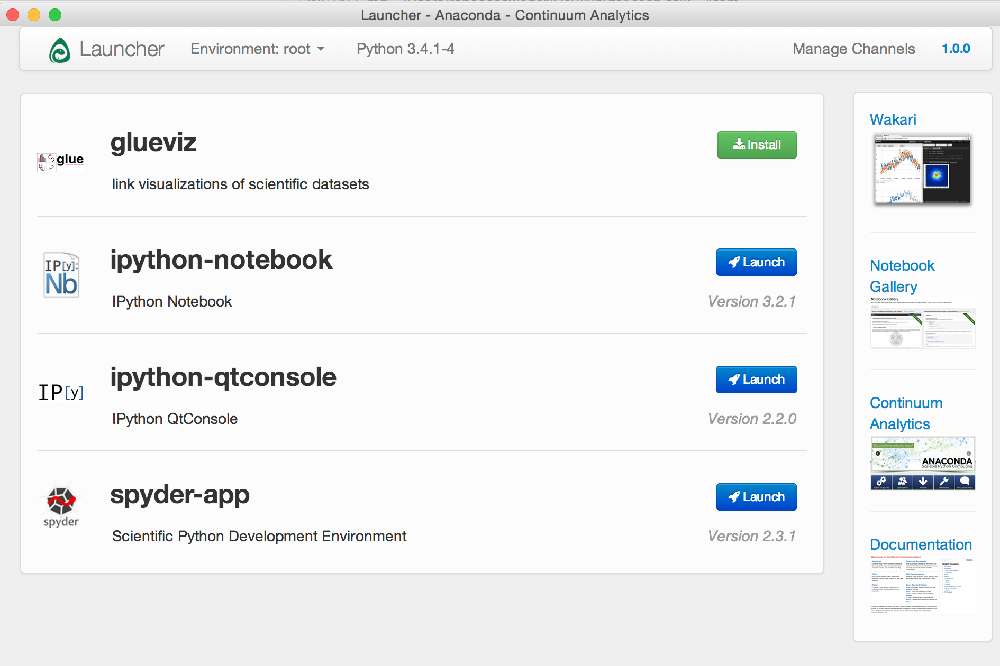

## Installing Jupyter and the Talk Components

### Local Setup

If you're running Linux or OSX and already have Python 3x running, you can clone this repo and install everything using its requirements.txt file. Assuming you're in a Python virtual environment, the process is relatively straightforward.

Another option is to skip these instructions and install a distribution that includes everything you need ([Enthought Canopy](https://www.enthought.com/products/canopy/) and [Continuum's Anaconda](https://store.continuum.io/cshop/anaconda/) -- documented below -- are two good options). If you're running Windows, definitely skip these local setup instructions and install Anaconda.

1. Clone the repository from GitHub:

        $ git clone git@github.com:18F/tech-talks.git
    **note:** if you don't have a GitHub account and want to get a read-only version of the code, use this command instead:

        $ git clone github.com:18F/tech-talks.git

1. Change to the directory that contains the Jupyter Notebook talk:

        $ cd tech-talks/jupyter-notebook

1. Install the required Python libraries:

        $ pip install -r requirements.txt

1. To start up a Jupyter notebook:

        $ jupyter notebook

This command will fire up a local Jupyter notebook server in your console and open a web browser to the URL of web application (by default, `http://127.0.0.1:8888`)

### Use Anaconda Distribution

Continuum's [Anaconda Python distribution](https://store.continuum.io/cshop/anaconda/) is a great way to get a hassle-free install of Jupyter and many, many Python libraries used in scientific computing - no matter what platform you're on.

It comes with a _lot_ of packages and might be overkill. But once you start playing around with the Python data stack, it's handy to focus on making things without worrying about installing libraries and sorting out Python package dependencies.

1. Download the [Anaconda installer](http://continuum.io/downloads#py34). Make sure you click _I Want Python 3.4_ to get the Python 3x packages.

1. Open the installer and follow the prompts. Accepting the default options is usually fine. By default, Anaconda installs into a single directory and doesn't affect other Python installations running on your system.

1. Anaconda usually installs into a folder called _anaconda_, located in your home directory. Find that folder, open it, and open the executable file named _Launcher_.

1. When the Launcher opens, click the _Launch_ button next to ipython-notebook (this is the old name for Jupyter notebook and will presumably be updated soon). This will start a local Jupyter notebook server and open a web browser.  
**Note:** If there's an _Upate_ button next to ipython-notebook, click that first (before you launch).



## Jupyter Notebook Config

To create a config file that will apply to all local notebooks:

```$ jupyter notebook --generate-config```

This creates config file template with everything commented out. By default, the file is created in ```[home directory]\.jupyter\jupyter_notebook_config.py```.

You can create more than one configuration file. To start jupyter notebook using a config file other than the default ```jupyter_notebook_config.py```:

```$ jupyter notebook --config=~/.jupyter/different_config_file.py```

To show the location of the config directory:

```$ jupyter --config-dir```

[More info on Jupyter config file options.](http://jupyter-notebook.readthedocs.org/en/latest/config.html#config "Jupyter config files")

[More info about default Jupyter directories and how to change them via environment variables](http://jupyter.readthedocs.org/en/latest/system.html "Jupyter on Your System")

## Formatting Notebooks

* To style an individual notebook, import a css file. For example:  
    ```from IPython.core.display import HTML
styles = open("css/presentation.css", "r").read()
HTML(styles)```

* To style all local notebooks, add a ```custom.css`` file to your Jupyter config directory:
    1. Determine the location of your Jupyter config directory:  
    ```$ jupyter --config-dir```
    2. In the above folder, create a folder called ```custom```
    3. Add ```custom.css``` to the ```custom``` folder. For example: ```~/.jupyter/custom/custom.css```


According to the Jupyter 4.0 docs, there are plans to provide a mechanism for notebook themes.

## Connect to Existing Kernel
Jupyter consists of two processes:
* [Kernel](https://github.com/ipython/ipython/wiki/IPython-kernels-for-other-languages): runs code
* Frontend (_e.g._, [terminal console](https://github.com/jupyter/jupyter_console "Jupyter console on GitHub"), [QTConsole](https://github.com/jupyter/qtconsole "QTConsole on GitHub"), [notebook](")

[Connect multiple frontends to an single kernel](http://jdfreder-notebook.readthedocs.org/en/docs/examples/Notebook/Connecting%20with%20the%20Qt%20Console.html)

## Notebook Security

[Information about Jupyter notebook's security model.](http://jupyter-notebook.readthedocs.org/en/latest/security.html "Security in Jupyter Notebooks")

## Notebook extensions

Notebook extensions add features to the notebook and are mostly written in Javascript.

It seems that the notebook extension community is still calling itself _IPython_, so keep that in mind when Googling.

Here's a [repo of helpful extensions](https://github.com/ipython-contrib/IPython-notebook-extensions).
